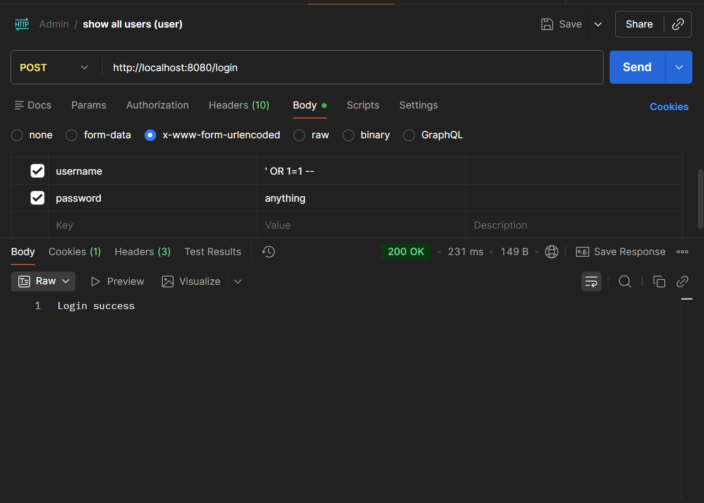
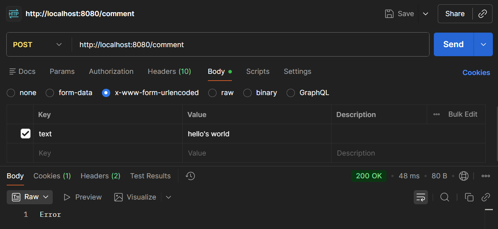

Assignment: Building a Secure Web System from Scratch (No Frameworks)

Part 1 — Implementation (Insecure First) - done! 

Part 2 — Vulnerability Discovery (OWASP Top 10)

1) Injection (SQL Injection)
In UserService: 

    public void register(String username, String password) throws SQLException {
        String sql = "INSERT INTO users1 (username, password) VALUES ('" + username + "', '" + password + "')";
        database.update(sql);
    }

    public boolean login(String username, String password) throws SQLException {
        String sql = "SELECT * FROM users1 WHERE username = '" + username + "' and password = '" + password + "'";
        ResultSet rs = database.executeQuery(sql);

        return rs.next();
    }

How it can be exploited: 
In postman request, for example: 
    
POST /login
    username: ' OR 1=1 --
    password: anything

Result: Login success

The SQL query becomes:
SELECT * FROM users1 WHERE username = '' OR 1=1 --' AND password = '123'
This bypasses authentication because 1=1 is always true.

OWASP: A03 - Injection

2) Broken SQL / Input Handling

In CommentService: 
    
    public void addComment(String username, String text) throws SQLException {
        String sql = "INSERT INTO comments (username, text) values ('" + username + "','" + text + "')";
        database.update(sql);
    }

How it can be exploited: 

    text: hello's world

Result: Error

Unescaped ' breaks SQL query.

Some text with apostrophe.

OWASP: A03 - Injection

3) Cross-Site Scripting (XSS)

   public void handle(HttpExchange exchange) throws IOException {

        try {
            List<String> comments = commentService.getComment();

            StringBuilder response = new StringBuilder();

            for (String c : comments) {
                response.append(c).append("\n");
            }

            Utils.send(exchange, response.toString());
        } catch (SQLException e) {
            e.printStackTrace();
            Utils.send(exchange, "Error");
        }
   }

How it can be exploited:

POST /comment

    text=

Result: Script is stored in database. Will execute in browser if rendered

You can't check the detailed task in Postman, only through a browser.

OWASP: A03 - Injection (XSS)

4) Sensitive Data Exposure

In LoginHandler and RegisterHandler. 

    String username = params.get("username");
    String password = params.get("password");

Passwords are stored in plain text in the database.
If the database is compromised, all user credentials are exposed.

OWASP: A02 - Sensitive Data Exposure

5) Broken Authentication / Session Issues

In SessionManager: 

    public class SessionManager {
    private final Map<String, String> sessions = new HashMap<>();

        public String createSession(String username, String password) {
            String sessionId = UUID.randomUUID().toString();
            sessions.put(sessionId, username);
            return sessionId;
        }

        public String getUser(String sessionId) {
            if (sessionId == null) return null;
            return sessions.get(sessionId);
        }
    }

Sessions have no expiration and can be reused indefinitely.
Session IDs are not protected with HttpOnly or Secure flags.

OWASP: A07 - Identification and Authentication Failures

6) Broken Access Control

GET /comments 

Any user can view all comments without restriction.
There is no ownership validation or authorization check.

OWASP: A01 - Broken Access Control

